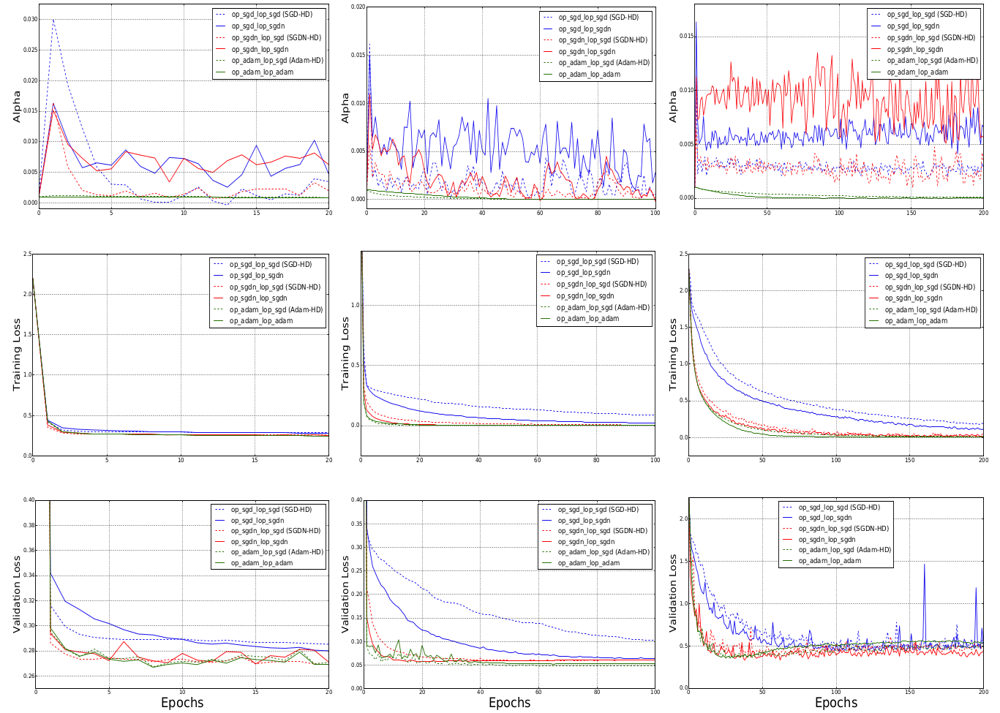

Hypergradient based Optimization Methods
===
This work tries improvements to the existing 'Hypergradient' based optimizers proposed in the paper [Online Learning Rate Adaptation with Hypergradient Descent][1].

## Introduction
The method proposed in the paper ["Online Learning Rate Adaptation with Hypergradient Descent"][1] automatically adjusts the learning rate to minimize some estimate of the expectation of the loss, by introducing the “hypergradient” - the gradient of any loss function w.r.t hyperparameter “eta” (the optimizer learning rate). It learns the step-size via an update from gradient descent of the hypergradient at each training iteration, and uses it alongside the model optimizers SGD, SGD with Nesterov (SGDN) and Adam resulting in their hypergradient counterparts SGD-HD, SGDN-HD and Adam-HD, which demonstrate faster convergence of the loss and better generalization than solely using the original (plain) optimizers. 

But we expect that the hypergradient based learning rate update could be more accurate and aim to exploit the gains much better by boosting the learning rate updates with momentum and adaptive gradients, experimenting with 
1. Hypergradient descent with momentum, and
2. Adam with Hypergradient, 

alongside the model optimizers SGD, SGD with Nesterov(SGDN) and Adam. 

The naming convention used is: **{model optimizer}<sub>op</sub>-{learning rate optimizer}<sub>lop</sub>**, following which we have **{model optimizer}<sub>op</sub>-SGDN<sub>lop</sub>** (when the l.r. optimizer is hypergradient descent with momentum) and **{model optimizer}<sub>op</sub>-Adam<sub>lop</sub>** (when the l.r. optimizer is adam with hypergradient).

The new optimizers and the respective hypergradient-descent baselines from which their performance are compared are given as
- SGD<sub>op</sub>-SGDN<sub>lop</sub>, with baseline SGD-HD (i.e. SGD<sub>op</sub>-SGD<sub>lop</sub>)
- SGDN<sub>op</sub>-SGDN<sub>lop</sub>, with baseline SGDN-HD (i.e SGDN<sub>op</sub>-SGD<sub>lop</sub>)
- Adam<sub>op</sub>-Adam<sub>lop</sub>, with baseline Adam-HD (i.e Adam<sub>op</sub>-SGD<sub>lop</sub>)

The optimizers provide the following advantages when evaluated against their hypergradient-descent baselines: Better generalization, Faster convergence, Better training stability (less sensitive to the initial chosen learning rate).


Motivation
---
The alpha_0 (initial learning rate) and beta (hypergradient l.r) configurations for the new optimizers are kept the same as the respective baselines from the paper (see [run.sh](https://github.com/harshalmittal4/HD_variants/blob/master/run.sh) for details). The results show that the new optimizers perform better for all the three models (VGGNet, LogReg, MLP).


<p align=center>Behavior of the optimizers compared with their hypergradient-descent baselines.</p>

<p align=center>Columns: left: logistic regression on MNIST; middle: multi-layer neural network on MNIST; right:
VGG Net on CIFAR-10.</p>

Project Structure
---
The project is organised as follows:

```bash
.
├── hypergrad/
│   ├── __init__.py 
│   ├── sgd_Hd.py  # model op. sgd, l.r. optimizer Hypergadient-descent (original)
│   └── adam_Hd.py #model op. adam, l.r. optimizer Hypergadient-descent (original)
├── op_sgd_lop_sgdn.py # model op. sgd, l.r. optimizer Hypergadient-descent with momentum
├── op_sgd_lop_adam.py # model op. sgd, l.r. optimizer Adam with Hypergadient 
├── op_adam_lop_sgdn.py # model op. adam, l.r. optimizer Hypergadient-descent with momentum
├── op_adam_lop_adam.py # model op. adam, l.r. optimizer Adam with Hypergadient
├── vgg.py
├── train.py
├── test/ # results of the experiments
├── plot_src/
├── plots/ # Experiment plots
├── run_.sh # to run the experiments
.
folders and files below will be generated after running the experiments
.
├── {model}_{optimizer}_{beta}_epochs{X}.pth           # Model checkpoint
└── test/{model}/{alpha}_{beta}/{optimizer}.csv        # Experiment results
```

Experiments
---
The experiment configurations (hyperparameters alpha_0 and beta) are defined in [run.sh](https://github.com/harshalmittal4/HD_variants/blob/master/run.sh)  for the optimizers and three model classes. The experiments for the new optimizers are run following the same settings as their Hypergradient-descent versions: Logreg (20 epochs on MNIST), MLP (100 epochs on MNIST) and VGGNet (200 epochs on CIFAR-10).

## References

1) [Hypergradient Descent (Github repository)](https://github.com/gbaydin/hypergradient-descent)

## Contributors
- [Harshal Mittal][2]
- [Yash Kant][3]
- [Ankit Dhankar][4]

[1]:https://arxiv.org/pdf/1703.04782.pdf
[2]:https://github.com/harshalmittal4
[3]:https://github.com/yashkant
[4]:https://github.com/Ankit-Dhankhar
